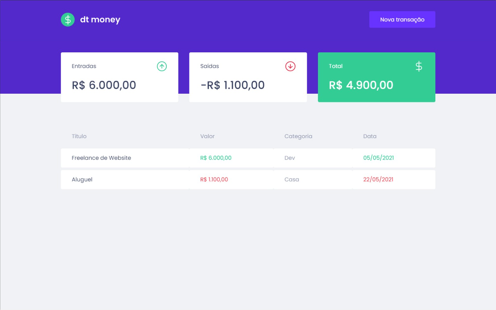

# DtMoney

Este projeto tem como propósito criar uma página de cadastro de transações, cadastro de compras e cadastro de rendimentos, bem como todos valores de entrada e de saida.

## Técnologias utilizadas

**Client:** ReactJS, Typescript.

**Server:** MirageJS, Axios.

## Autor

- [michelwene](https://www.linkedin.com/in/michelwene/)

## Lições Aprendidas

- Neste projeto aprendi como iniciar um projeto utilizando o create-react-app, como configurar ele do zero, deixando apenas o necessário.
- Aprendi as importância de dividir a página em componentes de uma forma em que se criasse um contexto para cada componente.
- Neste projeto usei muito as questões de propriedades, passando propriedades de pai para filho e também posteriormente utilizar o Context, para passar propriedades diretamente para outros componentes, sem utilizar componentes intermediários como "caminho".
- Aprendi a importância de se utilizar uma fake API para simular como minha página se comportaria com um back-end já elaborado, sem a necessidade de criação de um back-end inicialmente, "Utilizei o MirageJS como suporte de uma fakeAPI"
- Utilizei algumas bibliotecas como o React Modal, para criar meu Modal de cadastro de tarefas, muito simples de se utilizar.

## Screenshots

[GIF](./src/assets/DtMoney.gif)

